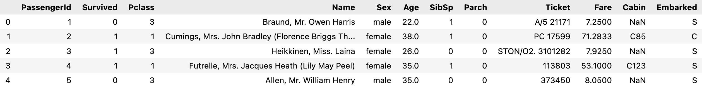

# Titanic
  - [분석 목표 및 결과](#분석-목표-및-결과)
  - [학습 데이터](#학습-데이터)
  - [데이터 전처리](#데이터-전처리)
  - [생존자 예측](#생존자-예측)

## 분석 목표 및 결과

- 타이타닉 데이터셋을 분석하고 적절하게 재구성하여 정확도 높은 모델을 개발하는 것을 목표로 진행
- Ensemble 기법 중 Hard Voting 방식을 활용해 최대 `0.85448` 정확도 수치에 도달

---

## 학습 데이터

- [타이타닉 데이터셋](https://www.kaggle.com/competitions/titanic/data)

---

## 데이터 전처리

- **Name** 열은 호칭에 해당하는 부분만 추출하여 4가지 범주형 값으로 변환
- 형제 동승자 수와 부모 동승자 수에 해당하는 **SibSp**, **Parch** 열을 하나로 합치고 가족 동승 여부 열로 변환
- **Age**, **Cabin** 열의 결측치를 선형 회귀 모델을 통한 예측값으로 대체
- 모든 범주형 열에 One-Hot Encoding 적용
    
    
    | Pclass | [ 1, 2, 3 ] |
    | --- | --- |
    | Name | [ 'Master.', 'Miss.', 'Mr.', 'Mrs.' ] |
    | Sex | [ 'male', 'female' ] |
    | Age | [ (-0.08, 16.0], (16.0, 32.0], (32.0, 48.0], (48.0, 64.0], (64.0, 80.0] ] |
    | Fare | [ (-0.001, 7.854], (7.854, 10.5], (10.5, 21.679], (21.679, 39.688], (39.688, 512.329] ] |
    | Cabin | [ 'T', 'A', 'B', 'C', 'D', 'E', 'F', 'G' ] |
    | Embarked | ['S', 'C', 'Q'] |
    | Family | [0, 1 |

---

## 생존자 예측

- 분류 모델, Stacking Ensemble, AutoML 순으로 예측 결과 확인
- 각각의 모델의 하이퍼 파라미터는 GridSearch를 사용해 최적화
    
    
    | Logistic Regression | 0.8432835820895522 |
    | --- | --- |
    | KNN | 0.8283582089552238 |
    | SVM | 0.8432835820895522 |
    | Decision Tree | 0.8395522388059702 |
    | Random Forest | 0.835820895522388 |
    | Naive Bayes | 0.7947761194029851 |
    | XGBoost | 0.8432835820895522 |
    | LightGBM | 0.8395522388059702 |
    | LDA | 0.835820895522388 |
    | Stacking 5-Fold | 0.8544776119402985 |
    | Stacking 10-Fold | 0.8507462686567164 |
    | FLAML | 0.8432835820895522 |